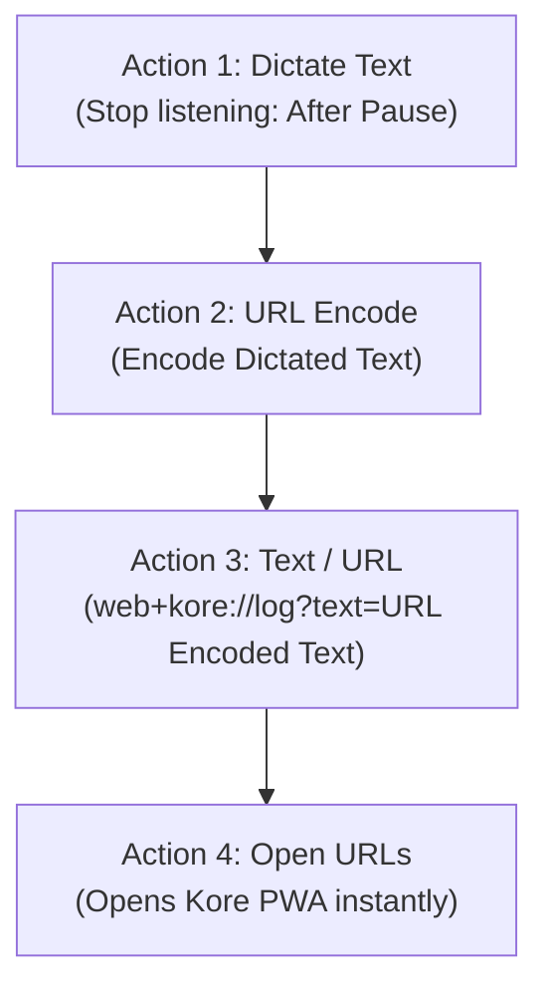

# 🎙️ Kore OS Voice Shortcuts Setup Guide

This guide provides step-by-step instructions for integrating **Kore - Financial Intelligence** directly with native OS voice assistants:
- **Apple iOS (Siri, Shortcuts & Action Button)**
- **Android (Google Assistant & Web Share Target)**

With this pipeline, speaking a transaction like *"Spent 15 RON on coffee at Starbucks with card"* will parse the natural language with Google Gemini, store it in Appwrite, and give haptic/visual confirmation in **under 3 seconds**.

---

## 📱 Option 1: Apple iOS (Siri & Apple Shortcuts)

You can trigger voice expense logging on iPhone and iPad via **Siri** ("*Hey Siri, Log Expense*"), the **Action Button** (iPhone 15 Pro / 16), or **Back Tap**.np

### 🛠️ Step-by-Step Shortcut Creation

1. Open the **Shortcuts** app on your iPhone or iPad.
2. Tap the **`+`** icon in the top right to create a new shortcut.
3. Rename the shortcut to **`Log Expense`** (or **`Kore Voice`**). *Note: The shortcut name is the phrase you will speak to Siri.*
4. Add the following **4 Actions** in sequence:



#### Action Details:
*   **Action 1: "Dictate Text"**
    *   Search for `Dictate Text`.
    *   Tap the arrow next to the action to customize:
        *   **Language**: Select your language (e.g., *English (US)* or *Romanian (Romania)*).
        *   **Stop Listening**: Set to `After Pause`.
*   **Action 2: "URL Encode"**
    *   Search for `URL Encode`.
    *   Ensure the input is linked to `Dictated Text` from Step 1.
    *   Set mode to **Encode**.
*   **Action 3: "URL" / "Text"**
    *   Search for `URL` (or `Text`).
    *   Enter the custom protocol URL:
        ```text
        web+kore://log?text=[URL Encoded Text]
        ```
        *(Insert the `URL Encoded Text` variable by tapping the variable bar above the keyboard).*
    *   *Alternative (Direct Web Link if PWA is deployed):*
        ```text
        https://kore-finance.vercel.app/quick-log?text=[URL Encoded Text]
        ```
*   **Action 4: "Open URLs"**
    *   Search for `Open URLs`.
    *   Pass the output from Action 3 to this action.

5. Tap **Done** in the top right.

---

### 🚀 How to Use on iOS

*   **Via Siri:**
    *   Say: *"Hey Siri, Log Expense"*
    *   Siri will prompt for dictation. Speak: *"Spent 45 lei on Uber by card"*
    *   Kore will open, Gemini will parse the text, Appwrite will record the transaction, and the screen will confirm with haptic vibration before auto-closing.
*   **Via Action Button (iPhone 15 Pro / 16):**
    *   Go to **Settings > Action Button**.
    *   Swipe to **Shortcut** and choose **`Log Expense`**.
    *   Press and hold the Action Button anytime to instantly speak and log an expense.
*   **Via Back Tap (Any iPhone):**
    *   Go to **Settings > Accessibility > Touch > Back Tap**.
    *   Select **Double Tap** or **Triple Tap** and choose **`Log Expense`**.

---

## 🤖 Option 2: Android (Google Assistant & Web Share Target)

Android supports two high-speed methods: **Web Share Target** and **Google Assistant Routines**.

### Method A: Web Share Target (Native Share Sheet)

Kore's PWA Manifest registers a `share_target`. Any text highlighted in apps, notes, or messages can be piped straight into Kore.

1. Highlight any transaction text or receipt summary on Android.
2. Tap **Share**.
3. Select **Kore Finance Tracker** from the native share sheet.
4. Kore opens directly into `/quick-log`, parses the payload with Gemini, saves the document to Appwrite, and shows the confirmation checkmark.

---

### Method B: Google Assistant Voice Routine

1. Open the **Google Assistant** app (or Google app settings) and go to **Settings > Routines**.
2. Tap **`+ New Routine`**.
3. Set **Starter (Voice Command)**:
   *   Tap *Add starter* > *Voice command*.
   *   Type: *"Log an expense"* or *"Note expense"*.
4. Set **Action (Custom URL / Chrome intent)**:
   *   Tap *Add action* > *Communicate and announce* or *Custom Command*.
   *   Set command to open the PWA deep link:
       ```text
       https://kore-finance.vercel.app/quick-log?text=$
       ```
       *(Or use an automation tool like **Tasker** or **Macrodroid** to capture voice and trigger `web+kore://log?text=...`).*

---

## ⚡ Examples of Spoken Natural Language Inputs

Gemini accurately extracts the amount, currency, category, payment method, and merchant from both English and Romanian:

| Spoken Voice Input | Parsed Type | Amount & Currency | Category | Payment Method | Merchant |
| :--- | :--- | :--- | :--- | :--- | :--- |
| *"Spent 15 RON on coffee at Starbucks with card"* | Expense | `15.00 RON` | `Food` | `Card` | `Starbucks` |
| *"Am cheltuit 50 de lei pe Uber"* | Expense | `50.00 RON` | `Transport` | `Card` *(Inferred)* | `Uber` |
| *"Bought 120 EUR groceries at Lidl with cash"* | Expense | `120.00 EUR` | `Food` | `Cash` | `Lidl` |
| *"A intrat salariul de 5000 lei"* | Income | `5000.00 RON` | `Salary` | `Card` | *(None)* |
| *"Paid 250 USD for electricity bill"* | Expense | `250.00 USD` | `Utilities` | `Cash` | *(None)* |
| *"Steam game purchase 60 EUR"* | Expense | `60.00 EUR` | `Entertainment` | `Card` *(Inferred)* | `Steam` |

---

## 🔧 Troubleshooting & Tips

1. **Protocol Handler Registration (`web+kore`):**
   * When you first open the installed PWA in Chrome / Edge, the browser may display a prompt asking: *"Allow Kore to handle web+kore links?"*. Tap **Allow**.
2. **PWA Installation:**
   * To ensure fastest startup, install Kore as a standalone PWA on your home screen via Safari (*Share > Add to Home Screen*) on iOS or Chrome (*Install App*) on Android.
3. **Authentication:**
   * Ensure you are logged into your Kore account in the PWA. If logged out, the Quick Log screen will prompt you to log in once before resuming background voice capture.
