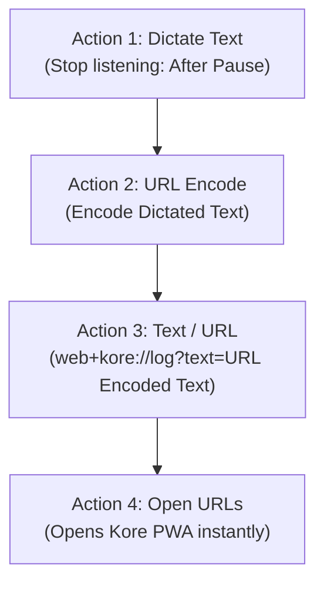
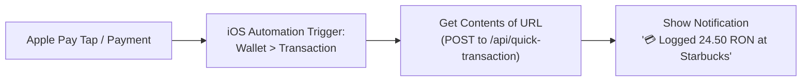

# 🎙️ Kore OS Voice Shortcuts Setup Guide

This guide provides complete instructions for integrating **Kore - Financial Intelligence** directly with native OS voice assistants and shortcuts on both **Apple iOS** and **Android (including devices using Google Gemini)**.

With this pipeline, speaking a transaction like *"Spent 15 RON on coffee at Starbucks with card"* will parse the natural language with Google Gemini, store it in Appwrite, and give haptic/visual confirmation in **under 3 seconds**.

---

## 📱 Option 1: Apple iOS (Siri, Shortcuts & Action Button)

You can trigger voice expense logging on iPhone and iPad via **Siri** ("*Hey Siri, Log Expense*"), the **Action Button** (iPhone 15 Pro / 16), or **Back Tap**.

### 🛠️ Step-by-Step Shortcut Creation

1. Open the **Shortcuts** app on your iPhone or iPad.
2. Tap the **`+`** icon in the top right to create a new shortcut.
3. Rename the shortcut to **`Log Expense`** (or **`Kore Voice`**). *Note: The shortcut name is the phrase you will speak to Siri.*
4. Add the following **4 Actions** in sequence:



#### Action Details:
*   **Action 1: "Dictate Text"**
    *   Search for `Dictate Text`.
    *   Tap the arrow next to the action to customize:
        *   **Language**: Select your language (e.g., *English (US)* or *Romanian (Romania)*).
        *   **Stop Listening**: Set to `After Pause`.
*   **Action 2: "URL Encode"**
    *   Search for `URL Encode`.
    *   Ensure the input is linked to `Dictated Text` from Step 1.
    *   Set mode to **Encode**.
*   **Action 3: "URL" / "Text"**
    *   Search for `URL` (or `Text`).
    *   Enter the custom protocol URL:
        ```text
        web+kore://log?text=[URL Encoded Text]
        ```
        *(Insert the `URL Encoded Text` variable by tapping the variable bar above the keyboard).*
    *   *Alternative (Direct Web Link if PWA is deployed):*
        ```text
        https://kore-finance.vercel.app/quick-log?text=[URL Encoded Text]
        ```
*   **Action 4: "Open URLs"**
    *   Search for `Open URLs`.
    *   Pass the output from Action 3 to this action.

5. Tap **Done** in the top right.

### 🚀 How to Use on iOS:
*   **Via Siri:** Say *"Hey Siri, Log Expense"* $\rightarrow$ speak your expense $\rightarrow$ auto-saved!
*   **Via Action Button (iPhone 15 Pro / 16):** Go to **Settings > Action Button** $\rightarrow$ choose **`Log Expense`**.
*   **Via Back Tap (Any iPhone):** Go to **Settings > Accessibility > Touch > Back Tap** $\rightarrow$ choose **`Log Expense`**.

---

## 💳 Option 1.5: 🍏 Apple Pay 100% Background Automation (iOS 17+)

Instead of speaking, you can have your iPhone **automatically log expenses the moment you tap to pay with Apple Pay at any terminal**!



### 🛠️ 60-Second Setup:
1. Open the **Shortcuts** app on your iPhone.
2. Tap the **Automation** tab at the bottom, then tap **`+`** (New Automation).
3. Search for **Transaction** (under *Cards & Passes / Wallet*).
4. Settings:
   - **Card**: Select *Any Card* (or your specific credit/debit card).
   - **Category / Merchant**: Any.
   - **When**: Select **Run Immediately** (do NOT choose *Ask Before Running*).
   - **Notify When Run**: Optional (keep off if you want only Kore's notification).
5. Tap **Next**, then choose **New Blank Automation**:
   - **Action 1: "Get Contents of URL"**
     - URL: `https://[your-kore-domain]/api/quick-transaction`
     - Method: **POST**
     - Request Body: **JSON**
     - Add fields:
       - `apiKey`: `[Your Personal Sync Key from Kore Settings > Auto-Pay]`
       - `amount`: *Shortcut Input &gt; Amount*
       - `merchant`: *Shortcut Input &gt; Merchant*
       - `currency`: *Shortcut Input &gt; Currency Code*
       - `source`: `Apple Pay`
   - **Action 2: "Get Dictionary Value"**
     - Key: `notification.body`
     - Dictionary: *Contents of URL*
   - **Action 3: "Show Notification"**
     - Text: *Dictionary Value*
     - Title: `Kore Finance`
6. Tap **Done**. Now every Apple Pay purchase logs invisibly in the background and rings with your confirmation!

---

## 🤖 Option 2: Android (Google Gemini, Assistant & Quick Actions)

> [!NOTE]
> **Why Google Assistant Routines show errors with Gemini:**
> Google recently replaced legacy Google Assistant with the **Google Gemini app** on Android. Gemini does not yet support arbitrary URL-opening actions in Routines. 
> Below are the **4 best, working alternatives** for modern Android devices.

---

### 🌟 Method A: Android Home Screen 1-Tap Voice Shortcut (Recommended - Easiest & Fastest)

Kore's PWA Manifest defines a native Android App Shortcut that opens directly in auto-listening mode.

1. Ensure Kore is installed as a PWA on your home screen (open Kore in Chrome $\rightarrow$ tap **Install app** or **Add to Home screen**).
2. **Long-press (tap and hold)** the Kore app icon on your home screen.
3. A popup menu appears showing **🎙️ Quick Voice Log**.
4. **Drag and drop** the **"Quick Voice Log"** icon directly onto your home screen as a standalone widget icon.
5. **How it works:**
   - Tap the **Quick Voice Log** icon anytime.
   - Kore instantly opens the sleek glassmorphic overlay and **automatically activates the microphone**.
   - Speak your expense (e.g. *"Am cheltuit 35 lei la Mega Image"* or *"Spent 15 dollars on lunch"*).
   - As soon as you pause, Gemini 3.6 Flash processes it, Appwrite saves it, and the screen confirms with haptic vibration before closing!

---

### ⚡ Method B: MacroDroid / Tasker (Exact Equivalent of Apple Shortcuts)

If you want a physical gesture trigger (e.g. double-pressing the volume button, shaking your phone, or a Quick Settings swipe-down tile) without touching an app icon:

1. Install **MacroDroid** (Free on Google Play Store).
2. Tap **Add Macro**:
   * **Trigger:** Choose your preferred trigger (e.g. *Volume Button Long Press*, *Shake Device*, or *Quick Settings Tile*).
   * **Action 1:** Search for **Voice Input** $\rightarrow$ Save speech to a variable named `expense_text`.
   * **Action 2:** Search for **Open Website / HTTP** $\rightarrow$ Enter URL:
     ```text
     https://kore-finance.vercel.app/quick-log?text={v=expense_text}
     ```
3. Save the Macro as **"Log Expense"**.
4. Now whenever you trigger it, your phone listens to your voice and immediately sends it into Kore!

---

### 🤖 Method B.2: Android Automatic Google Wallet & Bank Notification Tracker (MacroDroid)

Automatically capture incoming notifications from **Google Pay / Google Wallet** or your bank (Revolut, ING, BCR, Chase, etc.) without touching your phone:

1. Open **MacroDroid** $\rightarrow$ Tap **Add Macro**.
2. **Trigger:**
   - Tap **`+`** $\rightarrow$ **Notification** $\rightarrow$ **Notification Received**.
   - Select **Applications**: Choose **Google Wallet** (`com.google.android.apps.walletnf`), **Revolut**, or your Banking app.
   - Text content: Select **Any**.
3. **Action 1: HTTP Request (POST Ingestion)**:
   - Tap **`+`** $\rightarrow$ **Connectivity** $\rightarrow$ **HTTP Request**.
   - URL: `https://[your-kore-domain]/api/quick-transaction`
   - Request Method: **POST**
   - Content Type: `application/json`
   - Body:
     ```json
     {
       "apiKey": "[Your Personal Sync Key from Kore Settings > Auto-Pay]",
       "text": "[notif_text]",
       "source": "Google Pay"
     }
     ```
   - Save response to a string variable: `kore_response`.
4. **Action 2: Display Notification**:
   - Tap **`+`** $\rightarrow$ **Notification** $\rightarrow$ **Display Notification**.
   - Title: `💳 Kore Finance`
   - Message: `[lv=kore_response]` (or `Logged transaction from Google Pay`)
5. Save the macro as **"Kore Google Pay Sync"**.
6. Whenever you pay with Google Pay, Android automatically sends the notification to Kore, records the transaction with AI categorization, and confirms on your screen!

---

### 🔄 Method C: Switch Default Digital Assistant from Gemini to Google Assistant

If you specifically want the *"Hey Google, Log Expense"* voice routine:

1. Open your Android **Settings**.
2. Search for **Default Digital Assistant** (or go to **Apps > Default Apps > Digital Assistant app**).
3. Select **Google** (Google Assistant) instead of **Gemini**.
4. Open the Google app $\rightarrow$ **Settings > Google Assistant > Routines**.
5. Create a Routine:
   - **Starter (Voice):** *"Log Expense"*
   - **Action:** Open custom link `https://kore-finance.vercel.app/quick-log?text=$`
6. Now saying *"Hey Google, Log Expense"* will route through the routine.

---

### 📤 Method D: Android Native Share Sheet (Web Share Target)

Kore registers a `share_target` in the Android OS share sheet:

1. Whenever you have text in any app, WhatsApp, SMS receipt, or banking notification:
2. Highlight the text and tap **Share**.
3. Select **Kore Finance Tracker**.
4. Kore immediately opens `/quick-log`, parses the text with Gemini, and saves the transaction!

---

## ⚡ Examples of Spoken Natural Language Inputs

Gemini accurately extracts the amount, currency, category, payment method, and merchant from both English and Romanian:

| Spoken Voice Input | Parsed Type | Amount & Currency | Category | Payment Method | Merchant |
| :--- | :--- | :--- | :--- | :--- | :--- |
| *"Spent 15 RON on coffee at Starbucks with card"* | Expense | `15.00 RON` | `Food` | `Card` | `Starbucks` |
| *"Am cheltuit 50 de lei pe Uber"* | Expense | `50.00 RON` | `Transport` | `Card` *(Inferred)* | `Uber` |
| *"Bought 120 EUR groceries at Lidl with cash"* | Expense | `120.00 EUR` | `Food` | `Cash` | `Lidl` |
| *"A intrat salariul de 5000 lei"* | Income | `5000.00 RON` | `Salary` | `Card` | *(None)* |
| *"Paid 250 USD for electricity bill"* | Expense | `250.00 USD` | `Utilities` | `Cash` | *(None)* |
| *"Steam game purchase 60 EUR"* | Expense | `60.00 EUR` | `Entertainment` | `Card` *(Inferred)* | `Steam` |

---

## 🔧 Troubleshooting & Tips

1. **Protocol Handler Registration (`web+kore`):**
   * When you first open the installed PWA in Chrome / Edge, the browser may display a prompt asking: *"Allow Kore to handle web+kore links?"*. Tap **Allow**.
2. **Microphone Permissions:**
   * On first launch in `/quick-log`, allow microphone access so the auto-listening voice feature can activate instantly.
3. **Authentication:**
   * Ensure you are logged into your Kore account in the PWA. If logged out, the Quick Log screen will prompt you to log in once before resuming background voice capture.
