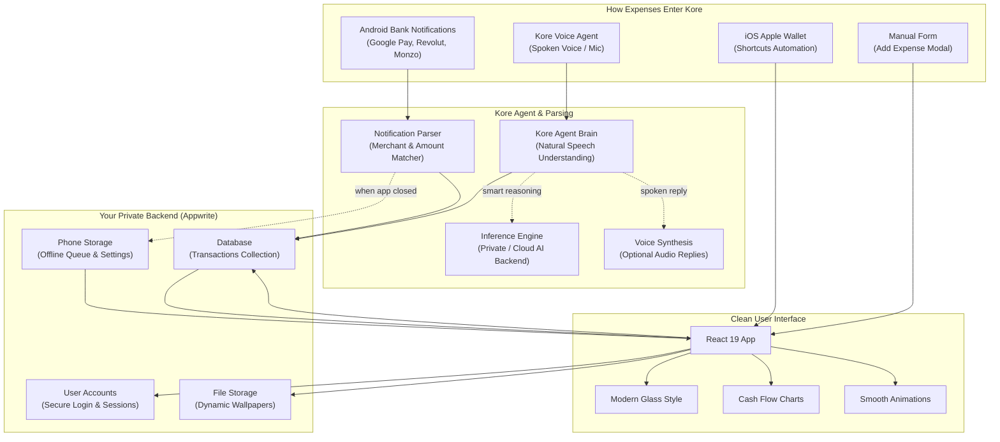

<p align="center">
  
</p>

<p align="center">
  <strong>A private, easy-to-use personal finance app featuring a built-in voice agent, automatic bank notification tracking, and clear cash flow forecasts.</strong>
</p>

<p align="center">
  <a href="https://github.com/Drynxx/kore-finance-tracker/blob/main/LICENSE"></a>
  <a href="https://react.dev/"></a>
  <a href="https://vitejs.dev/"></a>
  <a href="https://tailwindcss.com/"></a>
  <a href="https://appwrite.io/"></a>
  
  <a href="https://capacitorjs.com/"></a>
  
</p>

---

## Table of Contents

- [Overview](#overview)
- [Interface Showcase](#interface-showcase)
- [Key Capabilities](#key-capabilities)
  - [1. Personal Financial Agent](#1-personal-financial-agent)
  - [2. Automatic & Zero-Friction Logging](#2-automatic--zero-friction-logging)
  - [3. Visual Analytics & Cash Flow Forecasts](#3-visual-analytics--cash-flow-forecasts)
  - [4. Privacy & Full Data Ownership](#4-privacy--full-data-ownership)
- [Architecture & How It Works](#architecture--how-it-works)
- [Technology Stack](#technology-stack)
- [Quick Start](#quick-start)
  - [Prerequisites](#prerequisites)
  - [Local Installation](#local-installation)
  - [Appwrite Database Setup](#appwrite-database-setup)
- [Mobile & Native Platforms](#mobile--native-platforms)
  - [Android App & Auto-Pay Tracking](#android-app--auto-pay-tracking)
  - [iOS Apple Wallet Shortcuts](#ios-apple-wallet-shortcuts)
  - [Install as a Web App (PWA)](#install-as-a-web-app-pwa)
- [Project Documentation](#project-documentation)
- [License](#license)

---

## Overview

Most budget apps make tracking money feel like a second job with endless forms, rigid categories, and manual typing. 

**Kore** is built to remove that friction completely. Instead of filling out spreadsheets, Kore helps you capture expenses effortlessly:

1. **Speak Naturally**: Tell your built-in voice agent what you spent (*"Spent 45 RON on groceries at Mega Image with card"*), and Kore handles the rest.
2. **Automatic Bank Alerts (Android)**: A background listener reads payment alerts from Google Pay, Revolut, Wise, Monzo, and banks, logging your purchase automatically.
3. **Instant Apple Pay Taps (iOS)**: Automatically triggers an expense log whenever you pay with your iPhone or Apple Watch via Apple Wallet.

Your data stays on your terms: Kore uses an [Appwrite](https://appwrite.io) backend that you can host yourself or run in the cloud, keeping your personal finances private and secure.

---

## Interface Showcase

### Dashboard & 30-Day Forecast
See your current balance, category breakdown, daily average spend, and a clear projection of your cash flow for the next 30 days.

<p align="center">
  
</p>

### Voice Agent, Transaction List, and Settings

| Kore Voice Agent | Transaction History | Preferences & Auto-Pay |
|:---:|:---:|:---:|
|  |  |  |
| *Talk naturally to log purchases or ask questions* | *Clean history grouped by day with category icons* | *Configure auto-tracking and customize backgrounds* |

---

## Key Capabilities

### 1. Personal Financial Agent
Kore comes with a dedicated personal agent designed to understand everyday speech:
- **Speak in Plain Language**: Just say what happened (e.g., *"15 EUR on a train ticket"* or *"Dinner with friends for 120 RON"*). The agent automatically pulls out the amount, store, category, date, and payment method without requiring strict commands.
- **Ask About Your Spending**: Ask questions like *"How much did I spend on food this month?"* or *"What was my biggest expense this week?"* and receive quick, helpful answers based on your actual history.
- **English & Romanian Support**: Switch easily between English and Romanian (`RO` / `EN`) with full understanding in both languages.
- **Dynamic Voice Orb**: A glowing visualizer pulses on screen to let you know the app is listening.
- **Spoken Responses**: Optionally hear spoken answers back using natural ElevenLabs voice synthesis.

### 2. Automatic & Zero-Friction Logging
- **Android Background Auto-Pay**: On Android, Kore can read notifications from Google Wallet, Google Pay, Revolut, Wise, BT Pay, ING, and Monzo. When you pay for coffee, Kore logs it in the background—even if the app is closed.
- **iOS Apple Wallet Automations**: Use iOS 17 Shortcuts to trigger Kore the moment your card taps a payment terminal.
- **Quick Manual Entry**: For times you prefer typing, open the simple entry modal with instant category chips, date selection, and haptic feedback.

### 3. Visual Analytics & Cash Flow Forecasts
- **30-Day Spending Forecast**: A smooth trend line showing where your balance is headed over the next month based on your daily habits.
- **Category Donut ("Spending Art")**: An interactive donut chart highlighting your top spending areas at a glance.
- **Monthly Timeline**: Browse past months with back/forward arrows, view your all-time wealth, or start a fresh cycle.
- **Multi-Currency Converter**: Easily switch between USD, EUR, GBP, RON, and others with automatic rate conversion.

### 4. Privacy & Full Data Ownership
- **Self-Hostable**: Run your backend on your own server with Docker Appwrite, or use Appwrite Cloud.
- **One-Click Exports**:
  - **PDF Summary**: Clean, formatted report ready to save, print, or share.
  - **CSV File**: Raw spreadsheet export compatible with Excel, Google Sheets, or Notion.
- **Zero Ads, Zero Tracking**: No advertising networks, trackers, or commercial data selling.

---

## Architecture & How It Works



---

## Technology Stack

| Part | Tool | What It Does |
|:---|:---|:---|
| **Personal Agent** | **Kore Intelligence** | Understands spoken voice notes, classifies spending, and answers financial questions |
| **User Interface** | [React 19](https://react.dev/) | Fast, modular component-based web and mobile interface |
| **Build System** | [Vite 6](https://vitejs.dev/) | Instant development server and lightweight production builds |
| **Styling** | [Tailwind CSS 3.4](https://tailwindcss.com/) | Clean dark theme, glass cards, and mobile-friendly layouts |
| **Motion** | [Framer Motion 12](https://www.framer.com/motion/) | Smooth card transitions and reactive voice visualizer |
| **Charts** | [Recharts 3.5](https://recharts.org/) | Responsive cash flow trend lines and category donut breakdown |
| **Backend & Auth** | [Appwrite 21](https://appwrite.io/) | Handles user login, database storage, and wallpaper files |
| **Mobile Shell** | [Capacitor 8](https://capacitorjs.com/) | Runs Kore natively on Android with background notification access |
| **Voice Playback** | [ElevenLabs API](https://elevenlabs.io/) | Optional high-quality voice responses |
| **File Exports** | [jsPDF](https://github.com/parallax/jsPDF) & [FileSaver](https://github.com/eligrey/FileSaver.js) | Instant one-click PDF reports and CSV spreadsheet downloads |

---

## Quick Start

### Prerequisites
- **Node.js**: v18 or newer
- **npm** (included with Node)
- **Appwrite Project**: Set up a free account at [cloud.appwrite.io](https://cloud.appwrite.io) or use your own self-hosted server
- **Agent API Key**: A standard inference key (such as Google AI Studio) to power the voice agent's brain

### Local Installation

1. **Clone this repository:**
   ```bash
   git clone https://github.com/Drynxx/kore-finance-tracker.git
   cd kore-finance-tracker
   ```

2. **Install project dependencies:**
   ```bash
   npm install
   ```

3. **Set up your environment file:**
   Copy the example configuration:
   ```bash
   cp .env.example .env
   ```
   Open `.env` in your text editor and add your Appwrite credentials and agent key:
   ```env
   VITE_APPWRITE_ENDPOINT=https://cloud.appwrite.io/v1
   VITE_APPWRITE_PROJECT_ID=your_project_id
   VITE_APPWRITE_DATABASE_ID=your_database_id
   VITE_APPWRITE_COLLECTION_ID=transaction
   VITE_APPWRITE_WALLPAPER_BUCKET_ID=your_storage_bucket_id
   GEMINI_API_KEY=your_agent_api_key
   ```

4. **Start the app:**
   ```bash
   npm run dev
   ```
   Open `http://localhost:5174` in your browser to start using Kore!

---

### Appwrite Database Setup

In your Appwrite console, create a database and a collection named `transaction`. Add the following fields:

| Field Key | Type | Size / Rule | Required | What It Stores |
|:---|:---|:---|:---:|:---|
| `userId` | String | 255 chars | Yes | ID of the account owner |
| `type` | String | 32 chars | Yes | `'expense'` or `'income'` |
| `amount` | Float | Min: `0.01` | Yes | Money value of the purchase |
| `category` | String | 128 chars | Yes | Category tag (`Food`, `Transport`, `Groceries`, etc.) |
| `date` | String | ISO Date String | Yes | Date and time the expense happened |
| `note` | String | 500 chars | No | Store name or brief note |

#### Recommended Database Index
- **`idx_user_date`**: Attributes: `userId` (ASC), `date` (DESC) — keeps month-by-month lookups fast.

---

## Mobile & Native Platforms

### Android App & Auto-Pay Tracking
Kore has full native Android support. It includes a background notification service (`PaymentNotificationService.java`) that listens for payment alerts from banking and wallet apps.

1. **Build the Android project:**
   ```bash
   npm run cap:build
   ```
2. **Open in Android Studio:**
   ```bash
   npx cap open android
   ```
3. **Run on your device or emulator.**
4. **Enable Auto-Pay:**
   - In the app, open **Settings** $\rightarrow$ tap the **Auto-Pay** tab.
   - Tap **"Enable Notification Access in Settings"**.
   - Turn on access for **Kore** in Android settings.
   - Test it by tapping *"Test Google Pay Notification"* to see it parse a sample purchase!

For step-by-step technical details, see [GOOGLE_AND_APPLE_PAY_TRACKER_GUIDE.md](GOOGLE_AND_APPLE_PAY_TRACKER_GUIDE.md).

### iOS Apple Wallet Shortcuts
On iPhone, you can set up a quick 1-tap or automatic trigger using Apple Shortcuts:
1. Open the **Shortcuts** app on your iPhone.
2. Create a new Automation triggered by **Transaction** (Any Card).
3. Set the action to open:
   ```text
   web+kore://log?text=[Transaction Info]
   ```
   or send it to your Kore web app URL (`/quick-log`).
4. Read [OS_SHORTCUTS_GUIDE.md](OS_SHORTCUTS_GUIDE.md) for full screenshots and setup instructions.

### Install as a Web App (PWA)
You can install Kore directly to your home screen or desktop without an app store:
- Open Kore in Chrome or Safari.
- Click the **Install** button in the address bar (or choose **Add to Home Screen** on mobile).
- Works offline, loads instantly, and opens like a regular mobile app.

---

## Project Documentation

Helpful setup guides and architecture notes:
- [CODEBASE_EXPLANATION.md](CODEBASE_EXPLANATION.md) — Walkthrough of the code structure, context providers, and components.
- [GOOGLE_AND_APPLE_PAY_TRACKER_GUIDE.md](GOOGLE_AND_APPLE_PAY_TRACKER_GUIDE.md) — How the Android notification listener and iOS Apple Pay automations work.

---

## Contributing

Contributions, issues, and feature suggestions are welcome!
1. Fork the repo and create your branch (`git checkout -b feature/my-feature`).
2. Test your changes and run `npm run lint`.
3. Open a Pull Request with a clear description of what you improved.

---

## License

This project is licensed under the [MIT License](LICENSE).
