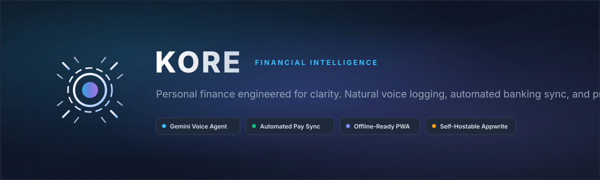
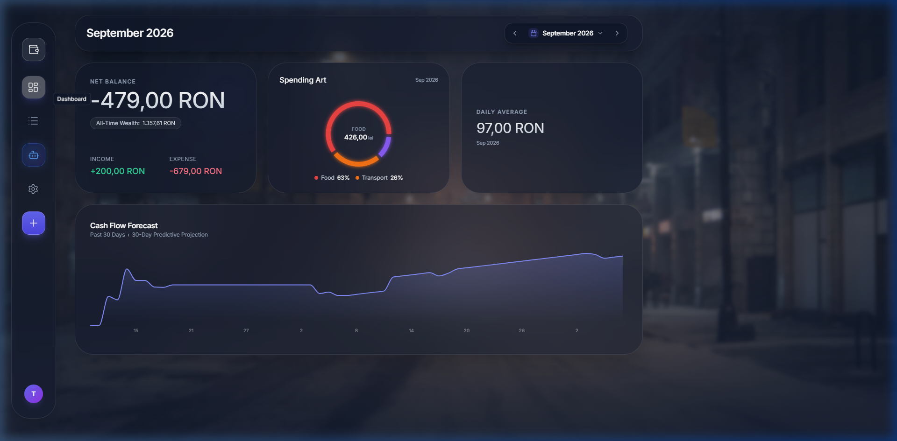
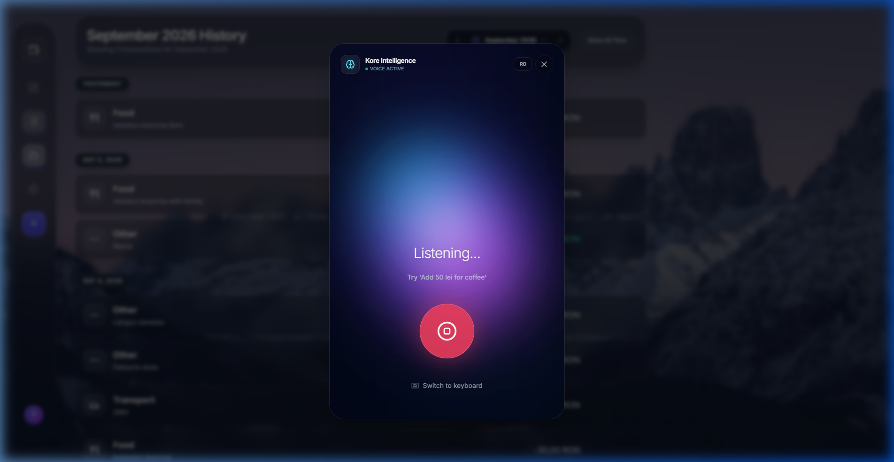
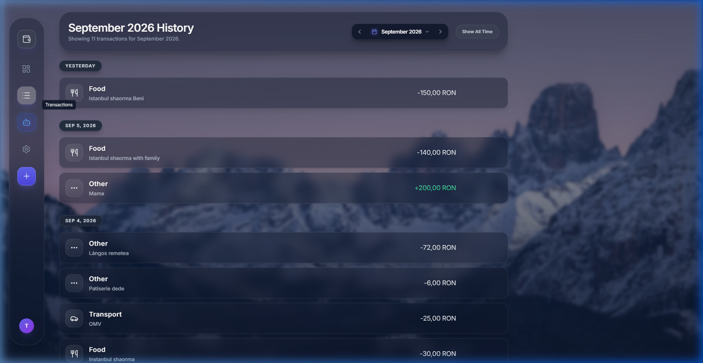
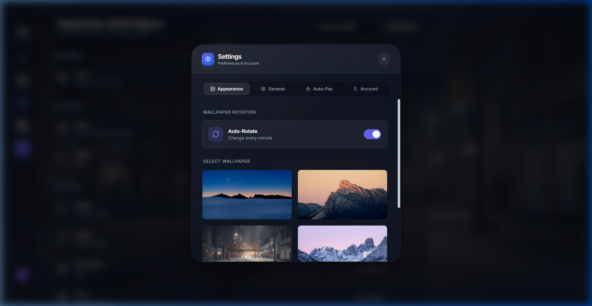
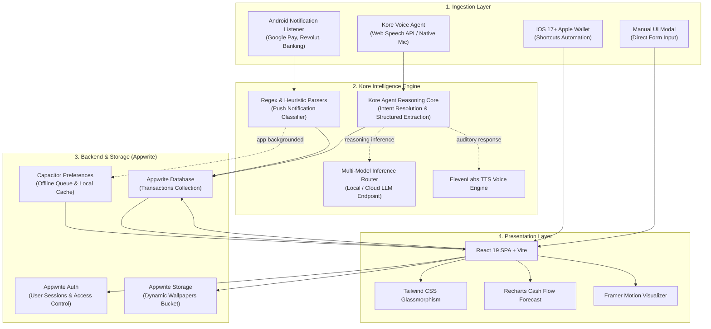

<p align="center">
  
</p>

<p align="center">
  <strong>An open-source, privacy-first personal finance platform featuring an autonomous personal financial agent, automated banking notification capture, and predictive cash flow analytics.</strong>
</p>

<p align="center">
  <a href="https://github.com/Drynxx/kore-finance-tracker/blob/main/LICENSE"></a>
  <a href="https://react.dev/"></a>
  <a href="https://vitejs.dev/"></a>
  <a href="https://tailwindcss.com/"></a>
  <a href="https://appwrite.io/"></a>
  
  <a href="https://capacitorjs.com/"></a>
  
</p>

---

## Table of Contents

- [Overview](#overview)
- [Interface Showcase](#interface-showcase)
- [Key Capabilities](#key-capabilities)
  - [1. Autonomous Personal Financial Agent](#1-autonomous-personal-financial-agent)
  - [2. Zero-Friction Transaction Ingestion](#2-zero-friction-transaction-ingestion)
  - [3. Predictive Cash Flow & Analytics](#3-predictive-cash-flow--analytics)
  - [4. Data Ownership & Portability](#4-data-ownership--portability)
- [Architecture & Data Pipeline](#architecture--data-pipeline)
- [Technology Stack](#technology-stack)
- [Quick Start](#quick-start)
  - [Prerequisites](#prerequisites)
  - [Local Installation](#local-installation)
  - [Appwrite Database Schema](#appwrite-database-schema)
- [Native & Mobile Setup](#native--mobile-setup)
  - [Android APK & Auto-Pay Service](#android-apk--auto-pay-service)
  - [iOS 17+ Apple Wallet Shortcut](#ios-17-apple-wallet-shortcut)
  - [Progressive Web App (PWA)](#progressive-web-app-pwa)
- [Configuration Reference](#configuration-reference)
- [Project Documentation](#project-documentation)
- [License](#license)

---

## Overview

**Kore** is an autonomous personal finance platform engineered to eliminate manual financial administration. Rather than requiring users to manually balance budgets or fill out multi-field forms, Kore operates through an integrated **Personal Financial Agent** coupled with automated operating system pipelines:

1. **Autonomous Personal Financial Agent**: Zero-touch conversational voice logging and natural language financial auditing (e.g., *"Spent 45 RON on groceries at Mega Image with card"* or *"What was my highest expense category this week?"*).
2. **Android Background Notification Listener**: Native Android service running via Capacitor that automatically parses amounts, merchants, and categories from Google Wallet, Google Pay, Revolut, Wise, Monzo, and banking push notifications.
3. **iOS 17+ Apple Wallet Automation**: Apple Shortcuts webhook triggering instantaneous expense logging upon tapping an Apple Pay terminal.

All records are persisted to an [Appwrite](https://appwrite.io) backend (cloud or self-hosted), ensuring users maintain complete privacy, sovereignty, and ownership over their financial records.

---

## Interface Showcase

### Financial Dashboard & Predictive Forecasting
Full overview showing net balance, category breakdown ("Spending Art"), daily burn velocity, and past 30 days plus 30-day linear projection curve.

<p align="center">
  
</p>

### Personal Financial Agent, Ledger, and Auto-Pay Settings

| Kore Personal Agent | Transaction Ledger | System & Auto-Pay Settings |
|:---:|:---:|:---:|
|  |  |  |
| *Real-time dynamic voice visualizer & autonomous agent parsing* | *Categorized history with date segmentation & totals* | *Auto-Pay background listener & appearance preferences* |

---

## Key Capabilities

### 1. Autonomous Personal Financial Agent
Kore operates with a dedicated personal agent engineered to continuously oversee, parse, and audit your cash flow:
- **Context-Aware Structured Extraction**: Translates raw conversational speech and unstructured text into strictly typed ledger entries (`amount`, `category`, `type`, `date`, `note`, `payment_method`) without requiring rigid syntax or keyword constraints.
- **Conversational Financial Auditing**: Directly query your agent with natural language questions like *"How much did I spend on dining out last month?"* or *"What is my current burn rate?"* for instant calculations derived from your active financial history.
- **Bilingual Intent Reasoning**: Dual-mode speech processing and reasoning in both English and Romanian (`RO` / `EN` toggle).
- **Acoustic Waveform Feedback**: Dynamic, math-driven audio cloud visualizer that pulses in real-time with vocal amplitude.
- **Auditory Synthesis**: Optional spoken feedback powered by high-clarity voice synthesis via ElevenLabs.

### 2. Zero-Friction Transaction Ingestion
- **Android `NotificationListenerService`**: Passively extracts transactions from Google Pay, Google Wallet, Revolut, Wise, BT Pay, ING, and Monzo notifications. Writes directly to the Appwrite database when backgrounded, or queues items in local storage for instant sync upon foregrounding.
- **iOS 17+ Apple Wallet Shortcut**: Custom protocol handler (`web+kore://` and `/quick-log`) compatible with native iOS Apple Wallet automation triggers.
- **Manual Ledger Entry**: Full-featured keyboard modal with quick categorization, date picker, and haptic feedback.

### 3. Predictive Cash Flow & Analytics
- **30-Day Forward Forecast**: Evaluates historical spending velocity and projects net balance trajectory over the subsequent 30 days.
- **Category Donut ("Spending Art")**: Real-time categorical distribution highlighting primary spending drivers with interactive drill-down.
- **Historical Month Traversal**: Month-by-month historical selector with a single-click "Show All Time" toggle and monthly reset workflows.
- **Multi-Currency Normalization**: On-the-fly currency conversion supporting USD, EUR, GBP, RON, and more.

### 4. Data Ownership & Portability
- **Self-Hostable Infrastructure**: Fully compatible with self-hosted Docker Appwrite deployments or Appwrite Cloud.
- **One-Click Export**:
  - **PDF Audit Report**: Clean tabular breakdown with custom layout formatting.
  - **CSV Raw Export**: Standard transactional dataset formatted for external spreadsheet analysis.
- **Zero Third-Party Telemetry**: Zero tracking cookies, third-party analytics, or commercial advertising libraries.

---

## Architecture & Data Pipeline



---

## Technology Stack

| Layer | Technology | Function |
|:---|:---|:---|
| **Personal AI Agent** | **Kore Intelligence Runtime** | Autonomous personal financial agent, conversational auditing, and structured entity extraction (pluggable LLM inference) |
| **Frontend Framework** | [React 19](https://react.dev/) | Component architecture, state management, and virtual DOM reconciliation |
| **Build Tool** | [Vite 6](https://vitejs.dev/) | High-speed HMR dev server and optimized production bundler |
| **Styling** | [Tailwind CSS 3.4](https://tailwindcss.com/) | Utility-first glassmorphism, responsive grid layouts, and dark mode |
| **Animations** | [Framer Motion 12](https://www.framer.com/motion/) | UI transitions and dynamic acoustic cloud visualizer |
| **Charts & Forecasts** | [Recharts 3.5](https://recharts.org/) | Linear cash flow projections and category distribution donut charts |
| **Backend as a Service** | [Appwrite 21](https://appwrite.io/) | User authentication, document database, and file storage |
| **Mobile Runtime** | [Capacitor 8](https://capacitorjs.com/) | Native Android runtime, background notification listener, and preferences |
| **Voice Synthesis** | [ElevenLabs API](https://elevenlabs.io/) | Optional conversational spoken voice feedback |
| **Export Engines** | [jsPDF](https://github.com/parallax/jsPDF) & [FileSaver](https://github.com/eligrey/FileSaver.js) | Client-side generation of PDF audit tables and CSV spreadsheets |

---

## Quick Start

### Prerequisites
- **Node.js**: v18.0.0 or higher
- **npm** or **pnpm**
- **Appwrite Instance**: Cloud ([cloud.appwrite.io](https://cloud.appwrite.io)) or self-hosted
- **Agent Inference Key**: An API key powering the agent's neural reasoning backend (configured via `GEMINI_API_KEY` or `OPENROUTER_API_KEY`)

### Local Installation

1. **Clone the repository:**
   ```bash
   git clone https://github.com/Drynxx/kore-finance-tracker.git
   cd kore-finance-tracker
   ```

2. **Install dependencies:**
   ```bash
   npm install
   ```

3. **Configure environment variables:**
   Copy the example environment template:
   ```bash
   cp .env.example .env
   ```
   Populate `.env` with your Appwrite project credentials and inference backend key:
   ```env
   VITE_APPWRITE_ENDPOINT=https://cloud.appwrite.io/v1
   VITE_APPWRITE_PROJECT_ID=your_project_id
   VITE_APPWRITE_DATABASE_ID=your_database_id
   VITE_APPWRITE_COLLECTION_ID=transaction
   VITE_APPWRITE_WALLPAPER_BUCKET_ID=your_storage_bucket_id
   GEMINI_API_KEY=your_inference_api_key
   ```

4. **Start the local development server:**
   ```bash
   npm run dev
   ```
   Open `http://localhost:5174` (or the port indicated in your console) to view the application.

---

### Appwrite Database Schema

Inside your Appwrite project, create a database and a collection named `transaction` (or your configured `VITE_APPWRITE_COLLECTION_ID`). Define the following attributes:

| Attribute Key | Type | Size / Constraint | Required | Description |
|:---|:---|:---|:---:|:---|
| `userId` | String | 255 chars | Yes | Appwrite Account ID of the document owner |
| `type` | String | 32 chars | Yes | `'expense'` or `'income'` |
| `amount` | Float | Min: `0.01` | Yes | Monetary value of transaction |
| `category` | String | 128 chars | Yes | Expense category (`Food`, `Transport`, `Groceries`, etc.) |
| `date` | String | ISO 8601 (or DateTime) | Yes | Timestamp of transaction occurrence |
| `note` | String | 500 chars | No | Merchant name, note, or tracking source |

#### Recommended Indexes
- **`idx_user_date`**: Key `userId` (ASC), Key `date` (DESC) — optimizes monthly query ranges.

---

## Native & Mobile Setup

### Android APK & Auto-Pay Service
Kore includes native Android code that implements a `NotificationListenerService` (`PaymentNotificationService.java`) to intercept incoming payment pushes from banking applications.

1. **Build and synchronize native Android assets:**
   ```bash
   npm run cap:build
   ```
2. **Open the project in Android Studio:**
   ```bash
   npx cap open android
   ```
3. **Run on a physical device or emulator.**
4. **Grant Notification Access:**
   - In Kore, open **Settings** $\rightarrow$ select the **Auto-Pay** tab.
   - Tap **"Enable Notification Access in Settings"**.
   - Enable **Kore** under Android's *Device & App Notifications* settings.
   - Send a test payment notification to verify automatic capture.

For complete implementation details, review [GOOGLE_AND_APPLE_PAY_TRACKER_GUIDE.md](GOOGLE_AND_APPLE_PAY_TRACKER_GUIDE.md) and [KORE_ANDROID_JAVA_ARCHITECTURE.txt](KORE_ANDROID_JAVA_ARCHITECTURE.txt).

### iOS 17+ Apple Wallet Shortcut
On iOS devices, expense tracking can be triggered instantly upon payment using Apple Shortcuts:
1. Create an automation in the iOS **Shortcuts** app with the **Transaction** trigger (Card: Any Card).
2. Direct the action to open:
   ```text
   web+kore://log?text=[Shortcut Input Amount and Merchant]
   ```
   or send a payload to your deployed Kore `/quick-log` endpoint.
3. Review [OS_SHORTCUTS_GUIDE.md](OS_SHORTCUTS_GUIDE.md) for step-by-step shortcuts configuration.

### Progressive Web App (PWA)
Kore is configured with `vite-plugin-pwa` for offline caching and home-screen installation:
- **Build production PWA**: `npm run build`
- **Preview service worker**: `npm run preview`
- Supports Web Share Target API and custom protocol handling (`web+kore`).

---

## Project Documentation

Detailed architectural notes and integration guides are available in the repository:
- [CODEBASE_EXPLANATION.md](CODEBASE_EXPLANATION.md) — Comprehensive deep dive into context providers, component architecture, and data flow.
- [GOOGLE_AND_APPLE_PAY_TRACKER_GUIDE.md](GOOGLE_AND_APPLE_PAY_TRACKER_GUIDE.md) — Technical instructions for Android Notification Access and iOS 17 Apple Wallet integration.
- [OS_SHORTCUTS_GUIDE.md](OS_SHORTCUTS_GUIDE.md) — Native OS shortcuts setup for Siri, Android Assistant, and the Action Button.
- [ANDROID_PLAYSTORE_LAUNCH_PLAN.md](ANDROID_PLAYSTORE_LAUNCH_PLAN.md) — Production release and verification plan for Android APK distribution.

---

## Contributing

Contributions are welcome. Please ensure that:
1. Pull requests follow existing code style and pass linting (`npm run lint`).
2. Changes to transaction handling preserve backwards compatibility with the Appwrite collection schema.
3. Mobile changes preserve Android Capacitor build stability (`npm run cap:build`).

---

## License

This project is licensed under the [MIT License](LICENSE).
